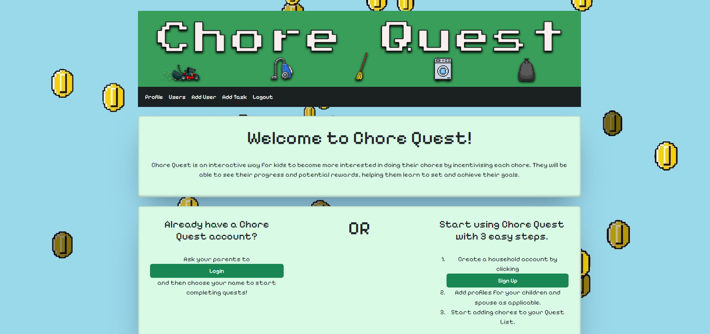
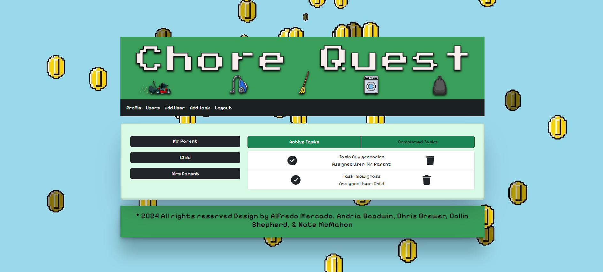

# Chore-Quest

## Description

Are you tired of staring at your to-do list, feeling overwhelmed by chores? Welcome to the ultimate solution to transform mundane chores into thrilling adventures with your family! Maybe your family struggles to get all the chores done for the week

Here's how it works: simply create an account for your family and add members to the household, both kids and parents. Now you can add input your chores and assign them to a designated member of your family. Now these simple chores transform into thrilling personalized quests.

Need to do the dishes? Conquer the Dishwashing Dungeon! 
Have laundry to fold? Embark on the Great Laundry Expedition!
Grass too tall? Battle back the Forest with your Spinning Blade of Fury!

## Table of Contents

- [Installation](#installation)
- [Usage](#usage)
- [Credits](#credits)
- [License](#license)

## Installation

Chore Quest has no installation requirements, simply navigate to the live URL on your preferred internet browser

## Usage

Follow the below URL to start your quest today!

https://chore-quest-0f3d855c0443.herokuapp.com/

Below is a screenshot of Chore Quest's homepage:

Below is a screenshot of an admin user's profile page on Chore Quest:

## Credits

There are five contributors to Chore Quest: Alfredo Mercado, Andria Goodwin, Chris Brewer, Collin Shepherd, Nate McMahon

## License

GMU (General Public License)
